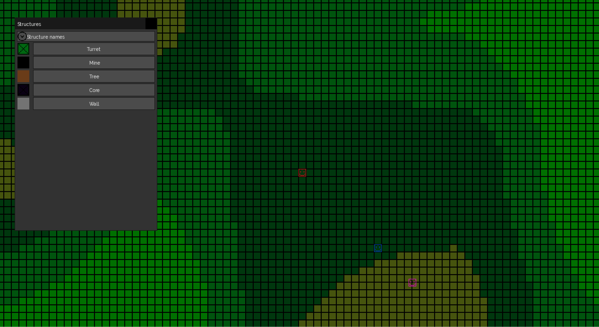
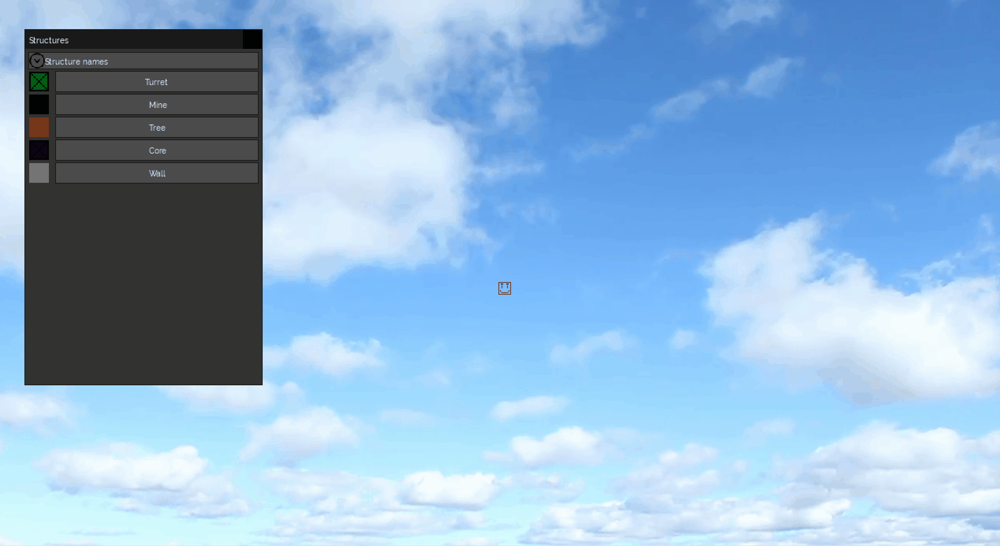

# 2D GameEngine

## Description

A small 2D game engine/game written in c++ and using SDL

The basic functionalities of a game engine/game are recreated with SDL in order to obtain maximum performance on specific game functionalities that I want to create

## Demo

### Movements, Structures and GUI

The player can move their camera and their body, place and break structures, and use a basic GUI to select which structure to place

Each player has their own window and body


### Entity behavior

Entities can have behaviors, for exemple the blue entity is busy harvesting wood and the pink entity is trying to kill the other poor entities



### Map

The map is generated when the player reaches the limits and the textures follow the perlin noise to make the map more realistic



## Libraries
##### SDL
- SDL2
- SDL_image
- SDL_ttf
- SDL_mixer

##### others
- [microui](https://github.com/rxi/microui)
- [tracy](https://github.com/wolfpld/tracy)
- [rapidjson](https://github.com/Tencent/rapidjson)
- [ut](https://github.com/boost-ext/ut)

## Commands
### Compile and run
#### Windows

##### Repository for Windows SDL libraries files

You can grab the Windows SDL libraries files from the repository below and add them to the game folders :

- https://github.com/fabiovandewaeter/windows-sdl-libraries-files

##### Compile

`mingw32-make`

###### run

`./bin/main.exe <width> <height> <FPS>`

#### macOS

install SDL libraries files :

- `brew install sdl2`
- `brew install sdl2_image`
- `brew install sdl2_ttf`
- `brew install sdl2_mixer`

compile with make :
- `make`

run :
- `.\bin\main <width> <height> <FPS>`

#### Linux (without root)

install SDL libraries files :

* SDL2
```bash
git clone https://github.com/libsdl-org/SDL.git -b SDL2
cd SDL2
./autogen.sh
./configure --prefix=$HOME/libs/SDL2
make
make install
export LD_LIBRARY_PATH=$HOME/libs/SDL2/lib:$LD_LIBRARY_PATH
```
* SDL_image:
```bash
wget https://www.libsdl.org/projects/SDL_image/release/SDL2_image-2.0.5.tar.gz
tar -xzf SDL2_image-2.0.5.tar.gz
cd SDL2_image-2.0.5/
./configure --prefix=$HOME/libs/SDL2
make
make install
```
* SDL_ttf:
```bash
wget https://www.libsdl.org/projects/SDL_ttf/release/SDL2_ttf-2.22.0.tar.gz
tar -xzf SDL2_ttf-2.22.0.tar.gz
cd SDL2_ttf-2.22.0/
./configure --prefix=$HOME/libs/SDL2
make
make install
```
* SDL_mixer:
```bash
wget https://www.libsdl.org/projects/SDL_mixer/release/SDL2_mixer-2.8.0.tar.gz
tar -xzf SDL2_mixer-2.8.0.tar.gz
cd SDL2_mixer-2.8.0/
./configure --prefix=$HOME/libs/SDL2
make
make install
```

compile with make :

- `make`

run :

- `.\bin\main <width> <height> <FPS>`

### Tracy profiler

You can use [tracy](https://github.com/wolfpld/tracy) to identify performance hotspots in the program

#### Windows

Download from the 0.11.1 release :

`https://github.com/wolfpld/tracy/releases/download/v0.11.1/windows-0.11.1.zip`

#### Linux

Clone the repository and use the following commands :

https://github.com/wolfpld/tracy

```bash
cmake -B profiler/build -S profiler -DCMAKE_BUILD_TYPE=Release -DTRACY_USE_LEGACY=ON -DLEGACY=ON
export SDKROOT=$(xcrun --sdk macosx --show-sdk-path)
cmake -B profiler/build -S profiler -DCMAKE_BUILD_TYPE=Release -DLEGACY=ON -DCMAKE_CXX_FLAGS="-Wno-deprecated-declarations" -DCMAKE_C_COMPILER=/usr/bin/clang -DCMAKE_CXX_COMPILER=/usr/bin/clang++ -DCMAKE_CXX_COMPILER=gcc-14 -DCMAKE_OSX_SYSROOT=/Library/Developer/CommandLineTools/SDKs/MacOSX.sdk -DCMAKE_ASM_COMPILER=/opt/homebrew/bin/as -DCMAKE_GIT_EXECUTABLE=/opt/homebrew/bin/git
cmake --build profiler/build --config Release --parallel
cd profiler/build
./tracy-profiler
```

#### macOS

`brew install tracy`
